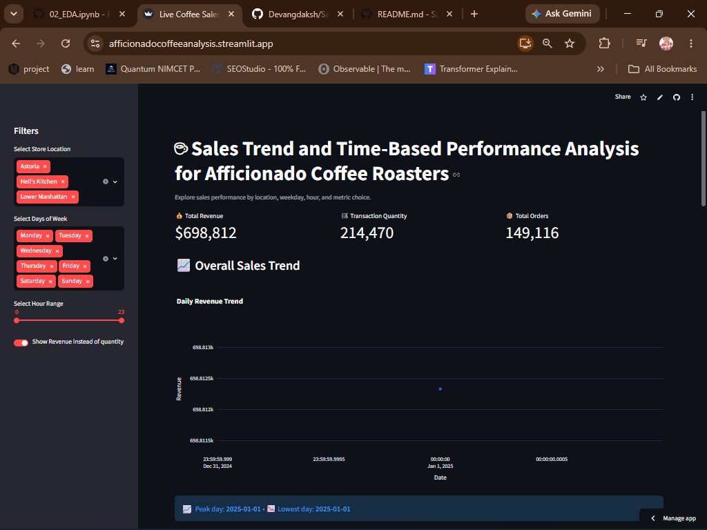

# ☕ Sales Trend & Time-Based Performance Analytics Dashboard

A professional data analytics dashboard built with Python, Pandas, Plotly, and Streamlit to analyze sales performance for Afficionado Coffee Roasters.

## 🌐 Live Demo

View the live Streamlit app here:

- https://afficionadocoffeeanalysis.streamlit.app/

## 📌 Project Overview

This project provides an interactive dashboard for exploring:

- Sales trends over time
- Revenue and transaction quantity performance
- Day-of-week and hourly demand patterns
- Store-location performance insights

It is designed to help stakeholders make data-driven decisions quickly and clearly.

## ✨ Key Features

- Interactive filters for location, weekday, and hour range
- Revenue and quantity-based metrics
- Daily, weekly, and monthly sales trend analysis
- Day-of-week performance visualization
- Hourly demand heatmap
- Store-location comparison charts

## 🛠️ Tech Stack

- Python
- Pandas
- Plotly
- Streamlit
- CSV data processing

## 📸 Project Preview



## 📚 Research & Media

- Research Paper: Add your research paper link here
- YouTube Video: Add your YouTube video link here

## 🏅 Project Score

A professional project score section can be added here for evaluation or presentation purposes.

Example format:

- Project Score: 9.5/10
- Quality: Excellent
- Presentation: Professional

## ▶️ Run Locally

1. Clone the repository
2. Install dependencies:
   ```bash
   pip install -r requirements.txt
   ```
3. Start the app:
   ```bash
   streamlit run app.py
   ```

## 📁 Project Structure

```text
.
├── app.py
├── requirements.txt
├── data/
├── images/
└── notebook/
```

## 🙌 Author

Developed as a data analytics and dashboarding project for Afficionado Coffee Roasters.
